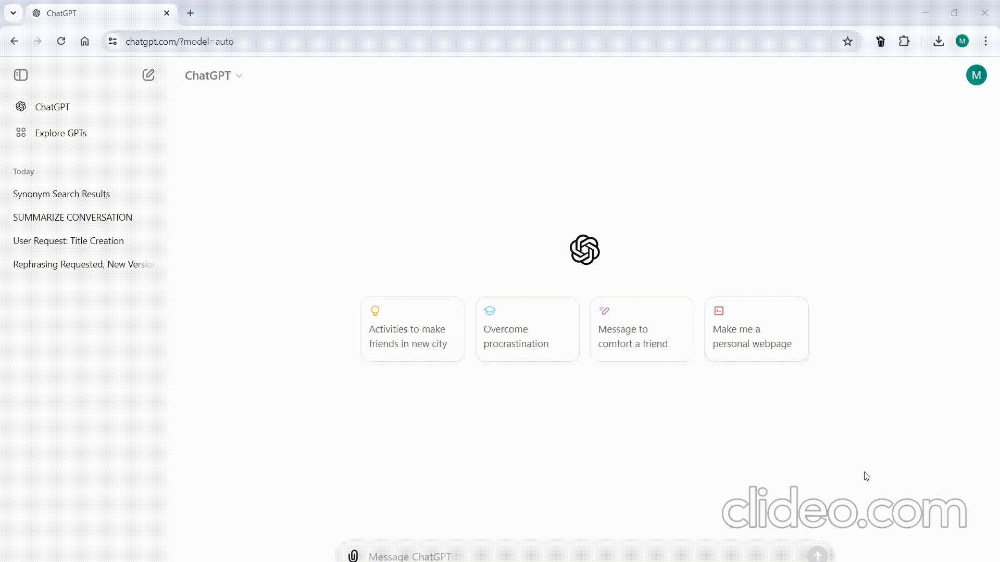

# ChatGPT Chat Delete Assistant

- It is a chrome extension that assists user for ChatGPT conversation deletion.  

- Once the extension is installed, users can select the conversations from left side bar of chatGPT interface using checkboxes, and delete them at once.  

- Additional features like, "Select All Conversations" and "De-select All Conversations" are also provided.  

- This extension is especially beneficial for frequent ChatGPT users who need to manage their conversations efficiently. It allows them to delete multiple conversations simultaneously, saving both time and effort compared to deleting them individually.  

- Source code link: [Github-repo](https://github.com/Mayureshdindorkar/ChatGPT-Chat-Delete-Assistant)

### Main Interface

### Selecting Conversations Individually
  

### Select All Conversations
  

### De-Select All Conversations

## Usage

1. Install the 'ChatGPT Chat Delete Assistant' Chrome extension.
2. Open the ChatGPT page.
3. Click on the 'ChatGPT Chat Delete Assistant' extension icon.
4. Select the conversations/chats that you want to delete by selecting the check boxes.
5. Click on 'Delete Selection' button.
6. Additional features like, "Select All Conversations" and 'De-select All Conversations' are also provided.
